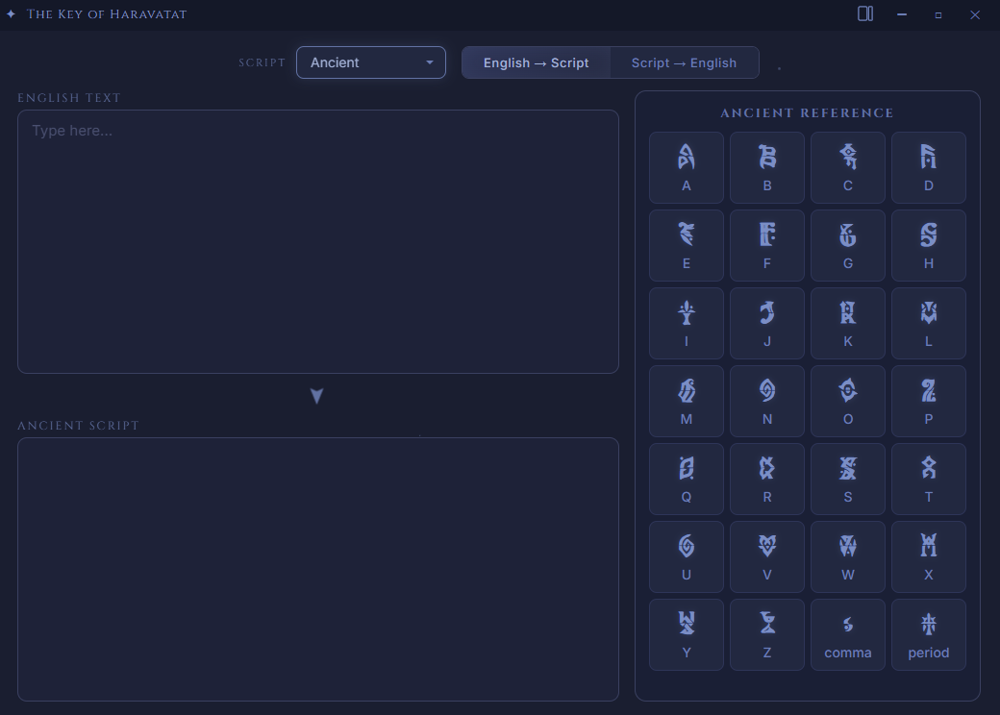
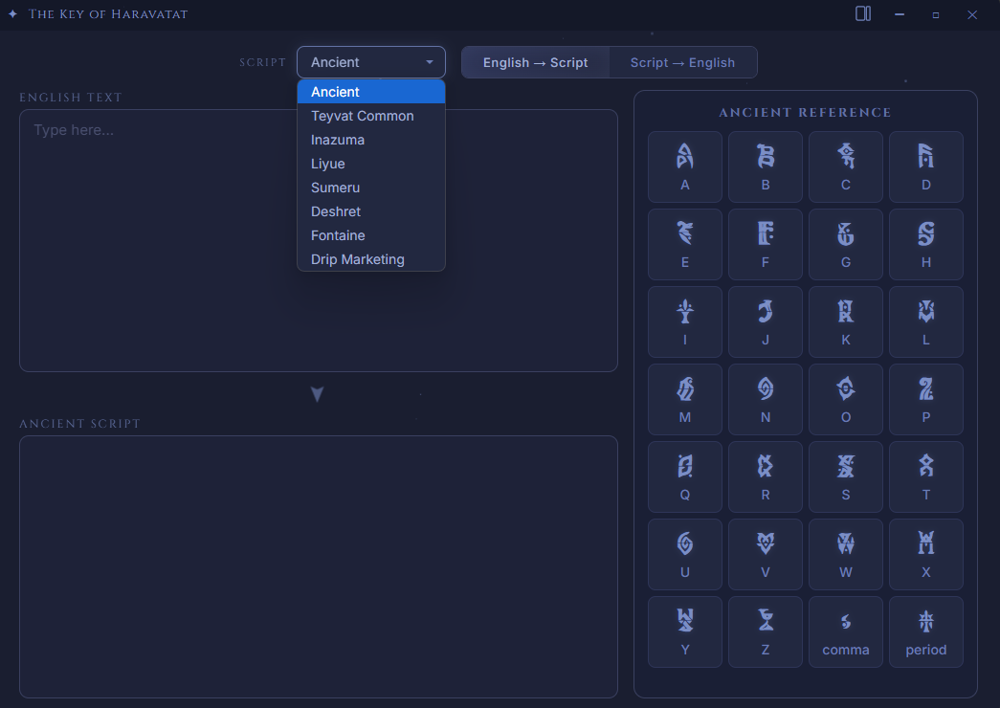
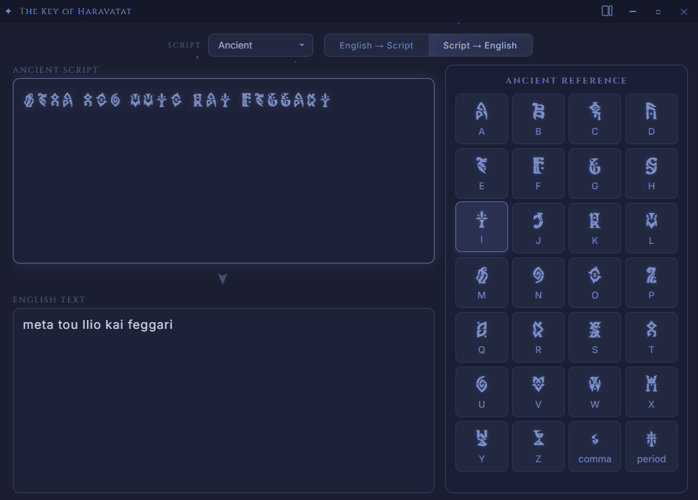

# The Key of Haravatat

**A Genshin Impact script decoder**

Translate scripts of Teyvat into English and back.


---

## Features

- **8 Scripts** - Ancient (Khaenri'ah), Teyvat Common, Inazuma, Liyue, Sumeru, Deshret, Fontaine, and Drip Marketing
- **Encode & Decode** - Type English to see it rendered in a Teyvat script, or type glyphs to reveal the English
- **Reference Chart** - Always-visible glyph chart that doubles as clickable input
- **Dual Layout** - Toggle between side-by-side and stacked views
- **Custom Titlebar** - Frameless window with a clean, native-feeling design

## Screenshots

<div align="center">



<br/><br/>



<br/><br/>



</div>


## Getting Started

### Prerequisites

- [Node.js](https://nodejs.org/) (v18+)

### Run from Source

```bash
git clone https://github.com/JustaKatto/key-of-haravatat.git
cd key-of-haravatat
npm install
npm start
```

### Build Portable Exe

```bash
npm run build
```

The output will be in the `dist/` folder.

## Font Credits

All Genshin script fonts are fan-made recreations by their respective authors.

| Script | Author |
| :--- | :--- |
| Drip Marketing | NekoJinnyArt |
| Teyvat Common | azusatsang |
| Liyue & Sumeru | puepeupeu |
| Inazuma & Deshret | Wenti-D |
| Fontaine | Reddit community |
| Ancient (Khaenri'ah) | Community |

Font collection sourced from [thomas200593/genshin-fonts-collections](https://github.com/thomas200593/genshin-fonts-collections).

## Legal

This is an unofficial fan tool and is not affiliated with, endorsed by, or connected to HoYoverse or miHoYo in any way.

&copy; All rights reserved by miHoYo. Other properties belong to their respective owners.


